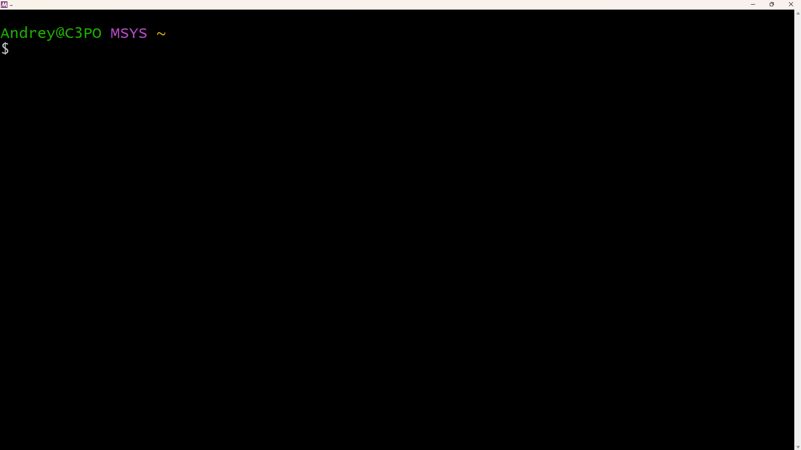
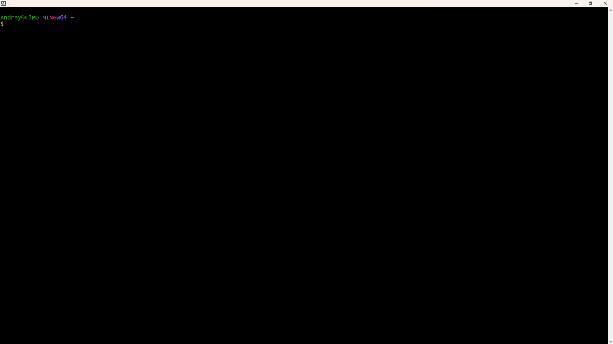

# Guia Completo para Compilar Allegro 5 com GCC no Windows


> Este é um tutorial definitivo que ensina o método mais robusto e livre de erros para configurar um ambiente de desenvolvimento C/C++ com a biblioteca Allegro 5 no Windows, utilizando o MSYS2 e o gerenciador de pacotes `pacman`.

---

Allegro é uma biblioteca multiplataforma voltada principalmente para programação de jogos e multimídia. Ela lida com tarefas comuns e de baixo nível, como criar janelas, receber entrada do usuário, carregar dados, desenhar imagens, reproduzir sons, entre outras, abstraindo a complexidade da plataforma subjacente. No entanto, Allegro não é uma engine de jogos: você tem liberdade para projetar e estruturar seu programa como preferir.

<p style="font-size: 0.95em; text-align: right;">Fonte: <a href="https://liballeg.org/" target="_blank">Site oficial do Allegro</a></p>

---

### <h2 id="indice">Índice Navegável</h2>

<ul>
  <li><a href="#arquivo-teste"><strong>Arquivo `main.c` de Teste</strong></a></li>
  <li><a href="#parte-1"><strong>Parte 1:</strong> Configuração Única do Ambiente</a></li>
  <li><a href="#parte-2"><strong>Parte 2:</strong> Compilando e Executando seu Projeto</a></li>
  <li><a href="#parte-3"><strong>Parte 3:</strong> Manipulando Arquivos e Diretórios</a>
    <ul>
      <li><a href="#estrutura-pastas">Estrutura de Pastas Recomendada</a></li>
      <li><a href="#compilando-arquivos">Compilando Arquivos em Outras Pastas</a></li>
      <li><a href="#carregando-recursos">Carregando Recursos (Imagens, Fontes, Sons)</a></li>
    </ul>
  </li>
</ul>

---

### <h2 id="arquivo-teste">Arquivo `main.c` de Teste</h2>

Para garantir que sua configuração está funcionando, use o código abaixo. Ele inicializa o Allegro, cria uma janela, exibe um texto e fecha após 5 segundos.

<details>
  <summary><strong>Clique para expandir e ver o código de <code>main.c</code></strong></summary>

  ```c
  #include <stdio.h>
  #include <allegro5/allegro.h>
  #include <allegro5/allegro_font.h> // Addon de fonte

  int main() {
      // Inicializa o Allegro e o addon de fonte
      if (!al_init()) {
          printf("Falha ao inicializar o Allegro!\n");
          return -1;
      }

      if (!al_init_font_addon()) {
          printf("Falha ao inicializar o addon de fonte!\n");
          return -1;
      }

      // Cria a janela
      ALLEGRO_DISPLAY* display = al_create_display(800, 600);
      if (!display) {
          printf("Falha ao criar a janela!\n");
          return -1;
      }
      
      ALLEGRO_FONT* font = al_create_builtin_font();
      if (!font) {
          printf("Falha ao criar a fonte!\n");
          al_destroy_display(display);
          return -1;
      }

      // Limpa a tela com uma cor
      al_clear_to_color(al_map_rgb(50, 10, 70));

      // Desenha o texto
      al_draw_text(font, al_map_rgb(255, 255, 255), 400, 300, ALLEGRO_ALIGN_CENTER, "Allegro Funciona!");

      // Mostra na tela
      al_flip_display();

      // Espera 5 segundos
      al_rest(5.0);

      // Limpa a memória
      al_destroy_font(font);
      al_destroy_display(display);

      return 0;
  }
  ```
</details>

---

### <h2 id="parte-1">Parte 1: Configuração Única do Ambiente</h2>

Esta é a base do nosso ambiente. Você só precisa fazer isso uma vez. A ferramenta principal aqui é o **MSYS2**.

<details>
  <summary><strong>Clique para expandir os passos de instalação</strong></summary>

  <h4>1.1 Instalar o MSYS2 e Atualizar</h4>
  <ol>
    <li>Vá para o site oficial: <a href="https://www.msys2.org/" target="_blank">https://www.msys2.org/</a> e baixe o instalador.</li>
    <li>Instale seguindo as instruções padrão.</li>
    <li>Ao final, abra o terminal <strong>MSYS2 MSYS</strong> (geralmente com ícone roxo). Use este terminal <strong>apenas para a atualização inicial do sistema</strong>.</li>
  <p align="center"></p>
    <li>Execute o comando <code>pacman -Syu</code>.</li>
  </ol>
  
  <div style="border: 2px solid red; border-radius: 5px; padding: 15px; background-color: #fff0f0;">
    <strong style="color: red;">AVISO IMPORTANTE:</strong> Durante o comando <code>pacman -Syu</code>, é normal que o terminal peça para ser fechado no meio do processo. Se isso acontecer, <strong>feche a janela, abra o mesmo terminal MSYS2 MSYS novamente e execute o comando <code>pacman -Syu</code> mais uma vez</strong> para garantir que a atualização seja concluída.
  </div>

  <h4>1.2 Instalar o Compilador GCC e o Allegro 5</h4>

  <ol>
    <li><strong>A partir de agora, para todo o resto, use sempre o terminal <strong>MSYS2 MINGW64</strong> (geralmente com ícone azul).</strong> Ele é a sua bancada de trabalho principal para programar.</li>
  <p align="center"></p>
    <li>Execute o comando abaixo para instalar de uma só vez o compilador, as ferramentas e a biblioteca Allegro 5:
      <pre><code>pacman -S --needed base-devel mingw-w64-x86_64-toolchain mingw-w64-x86_64-pkg-config mingw-w64-x86_64-allegro</code></pre>
      O <code>pacman</code> cuidará de todas as dependências automaticamente.
    </li>
  </ol>
</details>

<br>

Com o ambiente configurado, você está pronto para compilar qualquer projeto Allegro.

---

### <h2 id="parte-2">Parte 2: Compilando e Executando seu Projeto</h2>

Este é o fluxo de trabalho que você usará toda vez que for compilar.

1.  **Abra o Terminal Correto:** Sempre use o terminal **MSYS2 MINGW64** (Azul).

2.  **Navegue até a Pasta do Projeto:** Use o comando `cd` com o formato de caminho do Linux.
    ```bash
    # Exemplo para uma pasta na Área de Trabalho
    cd /c/Users/SeuNome/Desktop/MeuProjeto
    ```

3.  **Compile o Código:** Use o `gcc` em conjunto com o `pkg-config`. O `pkg-config` é uma ferramenta que informa ao `gcc` exatamente quais flags usar para encontrar e linkar as bibliotecas do Allegro.
    
    O código de teste precisa de `allegro-5` (núcleo), `allegro_font-5` (fontes) e `allegro_main-5` (essencial para Windows). O comando fica assim:
    ```bash
    gcc main.c -o jogo.exe $(pkg-config --libs --cflags allegro-5 allegro_font-5 allegro_main-5)
    ```

4.  **Execute o Programa:** Se o comando acima não retornou erros, o arquivo `jogo.exe` foi criado. Para rodá-lo:
    ```bash
    ./jogo.exe
    ```

---

### <h2 id="parte-3">Parte 3: Manipulando Arquivos e Diretórios</h2>

Projetos reais usam múltiplos arquivos e recursos. Veja como gerenciá-los.

<h4 id="estrutura-pastas">Estrutura de Pastas Recomendada</h4>

Organizar seu projeto é fundamental. Uma boa estrutura inicial seria:
```
/MeuSuperJogo
|
|-- /assets/
|   |-- fontes/
|   |   |-- minha_fonte.ttf
|   |-- imagens/
|   |   |-- nave.png
|   |-- sons/
|       |-- tiro.wav
|
|-- /src/
|   |-- main.c
|
|-- README.md
```

<h4 id="compilando-arquivos">Compilando Arquivos em Outras Pastas</h4>

Se você estiver no diretório raiz (`/MeuSuperJogo`) e seu código estiver em `/src/`, basta especificar o caminho no comando:

```bash
# Estando em /MeuSuperJogo, compile o arquivo que está em /src/
gcc src/main.c -o jogo.exe $(pkg-config --libs --cflags allegro-5 allegro_font-5 allegro_main-5)
```
O `jogo.exe` será criado na pasta raiz, onde você executou o comando.

<h4 id="carregando-recursos">Carregando Recursos (Imagens, Fontes, Sons)</h4>

O ponto mais importante é entender o **diretório de trabalho (working directory)**. Quando você executa <kbd>./jogo.exe</kbd> a partir da pasta `/MeuSuperJogo`, o programa procurará por arquivos a partir dessa mesma pasta.

**Exemplo de código (`src/main.c`) carregando uma imagem e uma fonte:**

```c
#include <allegro5/allegro.h>
#include <allegro5/allegro_image.h>
#include <allegro5/allegro_font.h>
#include <allegro5/allegro_ttf.h>
#include <stdio.h>

int main() {
    al_init();
    al_init_image_addon(); // Não se esqueça de iniciar os addons
    al_init_font_addon();
    al_init_ttf_addon();

    ALLEGRO_DISPLAY* display = al_create_display(800, 600);
    
    // Caminhos são relativos ao local do .exe!
    ALLEGRO_BITMAP* nave = al_load_bitmap("assets/imagens/nave.png");
    ALLEGRO_FONT* fonte = al_load_font("assets/fontes/minha_fonte.ttf", 32, 0);

    if (!nave || !fonte) {
        printf("Erro ao carregar recursos!\n");
        return -1;
    }

    // ... seu código de jogo aqui ...
    
    al_destroy_font(fonte);
    al_destroy_bitmap(nave);
    al_destroy_display(display);
    return 0;
}
```

<div style="border: 1px solid #666; border-radius: 5px; padding: 15px; background-color: #f0f0f0;">
  <strong><span style="color: #005a9c;">Dica de Mestre:</span> Adicionando Mais Addons</strong><br>
  O código acima usa <code>image</code> e <code>ttf</code>. Para compilá-lo, você precisa adicionar os pacotes correspondentes ao <code>pkg-config</code>. O comando cresce de forma lógica:
  <pre><code>gcc src/main.c -o jogo.exe $(pkg-config --libs --cflags allegro-5 allegro_font-5 allegro_image-5 allegro_ttf-5 allegro_main-5)</code></pre>
</div>

<hr>
<p align="center">Tutorial atualizado em 19 de setembro de 2025.</p>